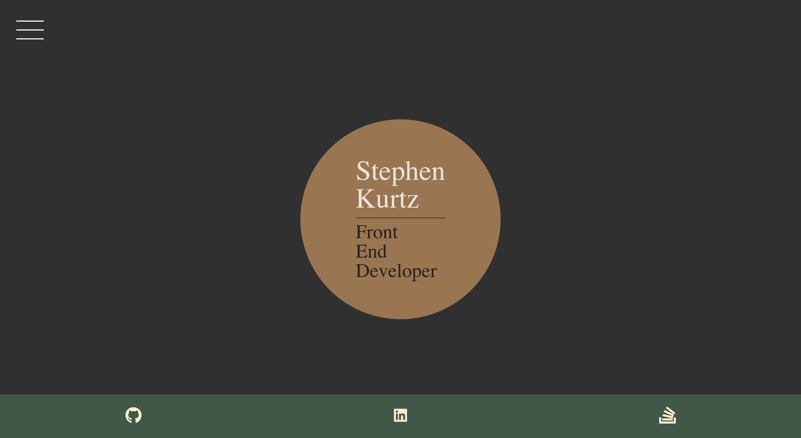

## About Me 
Frontend web developer from Philadelphia leveraging a strong customer service background to create user friendly web applications. Seeking to continually build my knowledge of the field by completing a rigorous 24-week Full Stack coding bootcamp through the University of Pennsylvania. Skilled in Javascript, React, Node.js, HTML, & CSS as well as in project communication. Adept at learning new skills independently, but also someone who thrives on collaborative development in a team environment.  

How to reach me: [LinkedIn](https://www.linkedin.com/in/stephenjkurtz/) | [stephenjkurtz@gmail.com](stephenjkurtz@gmail.com)

## Deployed
[stephenjkurtz.com](https://www.stephenjkurtz.com/)  
  

## 

## Technology Used
- React.js  
- React Icons 
- Javascript  
- HTML  
- CSS  
## Contributor
Stephen Kurtz  
